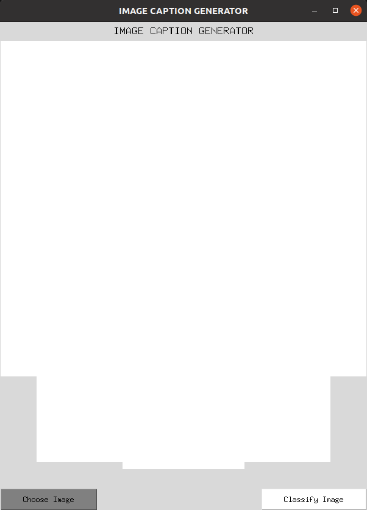

# Project Title: Image Caption Generator Using CNN and LSTM
## Introduction
Welcome to the Image Caption Generator project! This application combines the power of Convolutional Neural Networks (CNNs) and Long Short-Term Memory (LSTM) networks to automatically generate captions for images. The goal of this project is to build a model that can understand the content of an image and generate a meaningful, human-readable description based on its visual features.

In this repository, you'll find the implementation of an image captioning model that uses CNN for extracting visual features from images and LSTM for generating sequential text descriptions. The CNN architecture extracts key features of the image, while the LSTM network generates a natural language caption that accurately describes the image content.

This project demonstrates the synergy between computer vision and natural language processing, and can be applied in various fields like accessibility tools for the visually impaired, automatic image tagging, and content generation for media and social platforms.

Key Features:
1. ##### CNN for Feature Extraction: Uses pre-trained models like VGG16 and Xception to extract high-level visual features from images.
2. ##### LSTM for Caption Generation: Generates natural language descriptions by using LSTM networks, which capture the context and structure of language.
3. ##### Graphical User Interface (GUI): Allows flexibility to choose an image from the large dataset and displays the captions alongside of the image.

Feel free to explore the code, contribute, and enhance this project further! For more details on how to set up and use the model, check the installation and usage instructions below.
The project has several code files and massive dataset that includes images, text file, data objects and models.  Following are the details of each of those artifacts.

### File Structure on Github repo: https://github.com/nayanpat/ece5831-2024-final-project
1. import_dataset.py - This is to import flickr8k dataset using Keras library
2. feature_extractor.py - This file has a class that is used to extract feature vector from the image dataset
3. caption_data_processing.py - This has a class to process caption data (from the flickr8k dataset)
4. data_generator.py - This is to split and generate training and validation dataset and generator for fit() function
5. caption_generator_architecture.py - This has a class to define the model architecture and function to train, save and load model
6. model_prediction.py -  This is to do prediction using generated model
7. caption_generator.py - This is a script that is used to select and display an image alongwith its caption
8. final-project.ipynb - This IPython notebook is to show how to run the project and it hs executed cells with all required class
9. Plain_Background.jpg - This image file is needed for the GUI
10. image.png - is needed for the README.md file to display the inserted screenshot of the GUI
11. pop_up1.png - is needed for the README.md file to display the inserted screenshot of the GUI
12. pop_up2.png - is needed for the README.md file to display the inserted screenshot of the GUI
13. README.md - The file containing the details about the project and other files in github, google and youtube

### File Structure on Google Drive:
1. ##### dataset - https://drive.google.com/file/d/1uy-U1Dbr01SsqyEyqvIvk_vB-KcB3_tJ/view?usp=drive_link
2. ##### Presentation - https://docs.google.com/presentation/d/1MhNExQIUH_PRmOCTh5AUynyTn9ReAVNu/edit?usp=drive_link&ouid=115485934865010381115&rtpof=true&sd=true
3. ##### Report - https://drive.google.com/file/d/1AwVGq0DuwWk_Hgu_2LXfhWfUJqee-bcT/view?usp=drive_link

### youtube Channel Videos:
1. ##### Presentation Video - https://youtu.be/OfCuIIHYjoQ
2. ##### Demo video - https://youtu.be/SMtimpTQ2TM

### User's Manual
1. Download the dataset.zip file using the link above.  
2. The dataset.zip file contains following folders, so extract those folders directly under the folder where all the python code, script and IPython notebook files are located.
    1) dataset - This folder has all 8092 images under a folder 'images'.  This folder also contains the 'captions.txt' file which has human developed five captions for each image.
    2) generated_data - This folder contains all the pickle files needed for loading important data objects, such as features, tokenizer, max caption length, vocabulary size etc. which are necessary for model training and prediction.  Pickle module's load() function is used to load the contents of those pickle files.
    3) models - It has all the generated model which can be used to make prediction.  Keras load_model() function is used to load the model object.
3. Now, you are ready to deploy the script that is used to test your image for generating caption.  For doing that, run following commands from the terminal:

*conda activate ece5831-2024* -  This is to activate the conda environment
*python caption_generator.py xyz*  -  This is to launch the caption generator script  
The xyz here is the command line argument for the name of the feature extraction algorithm that you want to try out.  For VGG16, type *VGG16* and for Xception, type *Xception*.  
4. The above command will lead to a launching of a GUI that looks like following:

5. Click on the "Choose Image" button that opens a pop up window which allows you to select an image from the image database.  
6.  Once selected the image file, click on "Classify Image" button that pops up the image on a separate window.  

7. Close that window and click on the "Classify Image" button again that will run the prediction function in the backend and returns the caption that's displayed on the main GUI window.   

   
8.  You can modify the code in the "caption_generator.py" file and add a different model (.keras file) as desired.